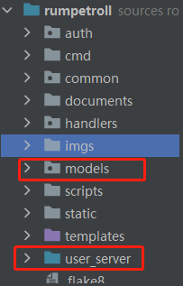
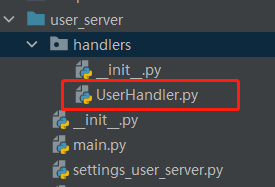
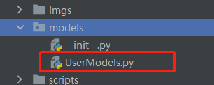
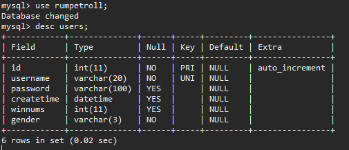

# 登录注册服务
项目开发前需要做如下准备工作
1. 在项目根目录下创建user_server、models目录，如下图：  


2. 在user_server下分别创建urls.py、settings_user_server.py、main.py文件以及handlers目录  


3. handlers目录下创建UserHandler.py文件  


4. models目录下创建UserModels.py文件  


5. 安装依赖包
> pip install -r requirements.txt


## 基于sqlalchemy创建数据库模型
在UserModels.py中创建Users模型，内容如下
```python
from pbkdf2 import crypt
from settings import Base
from datetime import datetime

from sqlalchemy import (
    Column,
    Integer,
    String,
    DateTime,
)

class Users(Base):
    """用户注册信息"""
    __tablename__ = "users"
    id = Column(Integer, primary_key=True, autoincrement=True)
    username = Column(String(20), nullable=False, unique=True)  # 不允许为空且唯一
    _password = Column("password", String(100))
    createtime = Column(DateTime, default=datetime.now)
    winnums = Column(Integer, default=0)  # 赢的总次数
    gender = Column(String(3), nullable=False)

    def _hash_password(self, password):
        return crypt(password, iterations=0x2537)

    @property
    def password(self):
        return self._password

    @password.setter
    def password(self, password):
        self._password = self._hash_password(password)

    def auth_password(self, pwd):
        if self._password:
            return self.password == crypt(pwd, self.password)
        else:
            return False
```


## 实现注册登录接口服务
实现tornado主服务，main.py（为游戏用户注册登录服务）文件内容如下：
```python
import os
os.environ["MODULE"] = "USER_SERVER"
import logging
import tornado.ioloop as ioloop
import tornado.httpserver as httpserver
import tornado.web as web
from urls import handlers
from settings_user_server import settings


class Application(web.Application):
    def __init__(self):
        web.Application.__init__(self, handlers, **settings)


LOG = logging.getLogger(__name__)
main_loop = ioloop.IOLoop.instance()


def main():
    http_server = httpserver.HTTPServer(Application())
    http_server.listen(settings.get("port"))
    main_loop.start()


if __name__ == '__main__':
    LOG.info("register server start")
    main()

```

添加路由URL，urls.py文件内容如下：
```python
from handlers.UserHandler import LoginHandler, RegisterHandler, ForgetHandler

handlers = [
    ("/login", LoginHandler),
    ("/register", RegisterHandler),
    ("/forget", ForgetHandler),
]
```

添加配置，settings_user_server.py内容如下：
```python
from settings import PORT, DEBUG
import os

BASE_DIR = os.path.dirname(__file__)

settings = dict(
    template_path=os.path.join(BASE_DIR, "templates"),
    static_path=os.path.join(BASE_DIR, "static"),
    xsrf_cookies=False,
    cookie_secret="bb904fe1b095cab9499a85f864e6c612",
    port=PORT,
    debug=DEBUG,
)
```

实现UserHandler，UserHandler.py内容如下：
```python
import json
from settings import session
from tornado.web import RequestHandler
from models.UserModels import Users

class LoginHandler(RequestHandler):
    """
    用户登录
    """
    def post(self):
        req_data = json.loads(self.request.body)
        username = req_data.get("username", "")
        password = req_data.get("password", "")
        if username and password:
            rememberme = req_data.get("rememberme", "off")
            if rememberme == 'on':
                self.set_secure_cookie("username", username)
                self.set_secure_cookie("password", password)
                self.set_secure_cookie("rememberme", "T")
            state, result = self.loginUser(username, password)
            if state:
                self.set_secure_cookie("currentuser", username)
        else:
            state = False
            result = "用户名或密码不能为空"
        self.finish({"status": state, "result": result})

    def loginUser(self, username, password):
        exists_username = session.query(Users).filter(Users.username == username).first()
        if not exists_username:
            return False, "不存在当前用户名"
        elif exists_username.auth_password(pwd=password):
            return True, {"username": exists_username.username, "gender": exists_username.gender}
        else:
            return False, "密码错误"

class RegisterHandler(RequestHandler):
    """
    用户注册
    """
    def post(self):
        result = "注册成功"
        req_data = json.loads(self.request.body)
        username = req_data.get("username", "")
        password = req_data.get("password", "")
        gender = req_data.get("gender", "1")
        if not username or not password:
            result = "注册失败，用户名或密码不能为空"
        state, res = self.createUser(username, password, gender)
        if not state:
            result = res
        self.finish({"result": result, "status": state})

    def createUser(self, username, password, gender):
        try:
            user_count = list(session.query(Users).filter(Users.username == username))
            if user_count:
                return False, 'Name is registered'
            user = Users()
            user.username = username
            user.password = password
            user.gender = gender
            session.add(user)
            session.commit()
            return True, "ok"
        except Exception as e:
            return False, e
```

在项目根目录下创建cmd目录，并创建init_data.py文件，用于数据库用户表的初始化，内容如下：
```python
from models.UserModels import Users, UserGolds

def init_data():
    Users.metadata.create_all()
    UserGolds.metadata.create_all()

if __name__ == '__main__':
    init_data()

```

运行init_data.py文件，运行过程中没报错即可。   
进入MySQL数据库，查看表结构，如下图：


启动用户登录注册服务，运行main.py文件即可