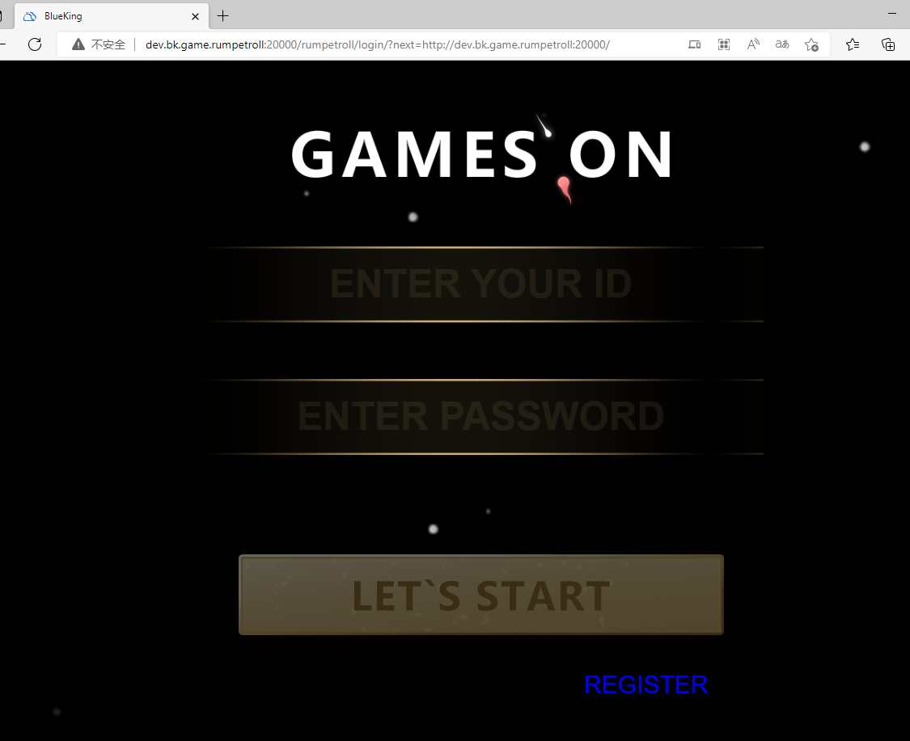

# 吃豆豆小游戏开发
## 开发目录结构搭建
1. 在项目根目录下分别创建目录
- templates 用于存放项目前端模板文件
- static 用于存放项目前端静态资源文件（css、js、images）
- handlers 用于存放tornado的系列服务请求（RequestHandler）
- common 用于存放公共组件调用方法
- cmd 存放执行命令的脚本程序  

2. 在项目根目录下分别创建文件
- main.py 游戏服务端入口主程序
- settings.py tornado游戏服务的系列配置
- urls.py tornado服务的路由和Handler映射文件  

3. 安装依赖包
> pip install -r requirements.txt

## 游戏后端服务
实现游戏主服务入口方法，main.py文件内容如下：
```python
import logging

import tornado.httpserver
import tornado.ioloop
import tornado.web
from tornado.options import options
import settings
from common.manager import namespace
from handlers.ws import (
    send_message_to_clients,
    send_ping_to_clients,
    update_node_status,
)
from urls import handlers


LOG = logging.getLogger(__name__)


class Application(tornado.web.Application):
    def __init__(self):
        tornado.web.Application.__init__(self, handlers, **settings.settings)


# Scheduler start

# 1000ms / 24fps
interval_ms = 42

main_loop = tornado.ioloop.IOLoop.instance()
scheduler = tornado.ioloop.PeriodicCallback(send_message_to_clients, interval_ms, io_loop=main_loop)
scheduler.start()

# 不让自动断开，默认2分钟没有任何数据交互会断开
ping_interval_ms = 10 * 1000
ping_scheduler = tornado.ioloop.PeriodicCallback(send_ping_to_clients, ping_interval_ms, io_loop=main_loop)
ping_scheduler.start()


# Scheduler for node status
scheduler_node_status = tornado.ioloop.PeriodicCallback(update_node_status, 1000, io_loop=main_loop)
scheduler_node_status.start()


# Scheduler for namespace heartbeat
scheduler_namespace = tornado.ioloop.PeriodicCallback(namespace.heartbeat, 1000, io_loop=main_loop)
scheduler_namespace.start()


def main():
    http_server = tornado.httpserver.HTTPServer(Application())
    http_server.listen(options.port, address=options.address)
    main_loop.start()

if __name__ == "__main__":
    LOG.info('rumpetroll start')
    main()

```

游戏服务相关配置，settings.py文件内容如下：
```python
import logging.config
import os.path
import redis
from dogpile.cache import make_region
from sqlalchemy import create_engine
from sqlalchemy.ext.declarative import declarative_base
from sqlalchemy.orm import sessionmaker
from tornado.options import define, options

# 组件标识
MODULE = os.environ.get("MODULE")

# 游戏服务和注册登录服务的端口配置
PORT = 20000
USER_SERVER_PORT = 30000
USER_SERVER_HOST = os.environ.get("USER_SERVER_HOST", "127.0.0.1")
if MODULE == "USER_SERVER":
    PORT = 30000
define("port", default=PORT, help="run on the given port", type=int)
define("address", default="127.0.0.1", help="bind address", type=str)
options.parse_command_line()

LOG = logging.getLogger(__name__)

# RUN_MODE DEVELOP PRODUCTION
RUN_MODE = os.environ.get('RUN_MODE', 'DEVELOP')

# 排名名单忽略列表
IGNORES_LIST = os.environ.get('IGNORES_LIST', [u'蓝鲸智云', 'Guest', 'guest'])

# 单房间最多连接数
MAX_ROOM_SIZE = int(os.environ.get('MAX_ROOM_SIZE', 3))
# 单进程最多房间数
MAX_ROOM = int(os.environ.get('MAX_ROOM', 2))

# 单进程最多房间数
ROOM_CLIENTS = int(os.environ.get('ROOM_CLIENTS', 3))

# 豆子分配区域
MIN_OF_MATRIX = int(os.environ.get('MIN_OF_MATRIX', -1000))
MAX_OF_MATRIX = int(os.environ.get('MAX_OF_MATRIX', 1000))
DIVISION_OF_MATRIX = int(os.environ.get('DIVISION_OF_MATRIX', 4))

# 豆子持续时间
OVERTIME = int(os.environ.get('OVERTIME', 60 * 5))

STATIC_VERSION = os.environ.get('STATIC_VERSION', 11)

BASE_DIR = os.path.dirname(__file__)

TOKEN = 'tPp5GwAmMPIrzXhyyA8X'
DEBUG = False

HTTP_PROXY = {}

SITE_URL = '/rumpetroll/'
STATIC_URL = '/rumpetroll/'
# 回调URL
DEFAULT_LOG_LEVEL = 'DEBUG'

# Redis配置
LOG_FILE = os.environ.get('LOG_FILE', '/tmp/rumpetroll.log')
REDIS_HOST = os.environ.get('REDIS_HOST', 'localhost')
REDIS_PORT = os.environ.get('REDIS_PORT', '6379')
REDIS_DB = os.environ.get('REDIS_DB', '0')
REDIS_PASSWORD = os.environ.get('REDIS_PASSWORD', '')

# MySQL配置
MYSQL_HOSTNAME = os.environ.get("MYSQL_HOSTNAME", '127.0.0.1')
MYSQL_PORT = os.environ.get("MYSQL_PORT", '3306')
MYSQL_DATABASE = os.environ.get("MYSQL_DATABASE", 'rumpetroll')
MYSQL_USERNAME = os.environ.get("MYSQL_USERNAME", 'root')
MYSQL_PASSWORD = os.environ.get("MYSQL_PASSWORD", '123456')

# 数据连接 URL
DB_URI = 'mysql+pymysql://{}:{}@{}/{}?charset=utf8'.format(
    MYSQL_USERNAME,
    MYSQL_PASSWORD,
    MYSQL_HOSTNAME,
    MYSQL_DATABASE,
)

# 缓存连接
pool = redis.ConnectionPool(host=REDIS_HOST, port=REDIS_PORT, db=REDIS_DB, password=REDIS_PASSWORD)
rd = redis.Redis(connection_pool=pool)

# 数据库ORM连接
engine = create_engine(DB_URI)
Base = declarative_base(engine)
Session = sessionmaker(engine)
session = Session()

NAMESPACE_NAME = '{}:{}'.format(options.address, options.port)

region = make_region().configure(
    'dogpile.cache.redis',
    expiration_time=7200,
    arguments={
        'connection_pool': pool,
    },
)

# 模板title
TITLE = u"BlueKing"

# 认证模块
AUTH_MODULE = os.environ.get('AUTH_MODULE', 'dummy')

# tornado服务配置
settings = dict(
    template_path=os.path.join(BASE_DIR, "templates"),
    static_path=os.path.join(BASE_DIR, "static"),
    xsrf_cookies=False,
    cookie_secret="bb904fe1b095cab9499a85f864e6c612",
    port=PORT,
    debug=DEBUG,
)

# 日志格式配置
LOGGING_CONFIG = {
    'version': 1,
    'disable_existing_loggers': False,
    'formatters': {
        'simple': {
            'format': '[%(asctime)s] {NAMESPACE_NAME} %(levelname)s  %(name)s: %(message)s'.format(
                **{'NAMESPACE_NAME': NAMESPACE_NAME}
            )  # noqa
        }
    },
    'handlers': {
        'console_simple': {
            'level': 'DEBUG',
            'class': 'logging.StreamHandler',
            'formatter': 'simple',
        },
        'file_simple': {
            'level': 'DEBUG',
            'class': 'logging.FileHandler',
            'formatter': 'simple',
            'filename': LOG_FILE,
        },
    },
    'loggers': {
        'tornado': {
            'handlers': ['console_simple'],
            'level': 'DEBUG',
            'propagate': False,
        },
    },
    'root': {
        'level': 'DEBUG',
        'handlers': ['console_simple'],
    },
}

if not DEBUG:
    LOGGING_CONFIG['root']['handlers'] = ['file_simple']
    LOGGING_CONFIG['loggers']['tornado']['handlers'] = ['file_simple']

logging.config.dictConfig(LOGGING_CONFIG)

```

服务路由，urls.py文件内容如下：
```python
import tornado

import settings
from handlers import api, main, ws

handlers = [
    # 游戏主页面
    (r"/", main.IndexHandler),
    (r"/rumpetroll", main.IndexHandler),
    (r"/rumpetroll/", main.IndexHandler),
    # 登录页面
    (r"/rumpetroll/login/", main.LoginHandler),
    # 注册页面
    (r"/rumpetroll/register/", main.RegisterHandler),
    (r"/rumpetroll/admin/", main.AdminHandler),
    # 排名页面
    (r"/rumpetroll/rank/", main.RankHandler),
    # 错误提示页面
    (r"/rumpetroll/error/", main.ErrorHandler),
    # 多节点 统一socket.io前缀
    (r"/rumpetroll/socket.io/(?P<server>[a-z-_A-Z0-9]+)/(?P<port>[a-z-_A-Z0-9]+)/", ws.WSHandler),
    # 单节点
    (r"/rumpetroll/socket.io/(?P<port>[a-z-_A-Z0-9]+)/", ws.WSHandler),
    # 开发环境
    (r"/rumpetroll/socket.io/", ws.WSHandler),
    (r"/rumpetroll/api/get_endpoint/", api.GetEndpointHandler),
    (r"/rumpetroll/api/get_username/", api.GetUserNameHandler),
    (r"/rumpetroll/api/stat/", api.GetStatHandler),
    (r"/rumpetroll/api/user/", api.GetUserHandler),
    # 添加金币
    (r"/rumpetroll/api/gold/", api.GoldsHandler),
    # 获取游戏排名数据
    (r"/rumpetroll/api/rank/", api.RankDataHandler),
    (r"/rumpetroll/api/export/", api.ExportHandler),
    (r"/rumpetroll/api/func_controller/", api.FunctionController),
    (r"/rumpetroll/api/clean/", api.CleanHandler),
    # for debug static, product use nginx
    (r'/rumpetroll/static/(.*)', tornado.web.StaticFileHandler, {'path': settings.settings['static_path']}),
]
```

#### 实现游戏请求服务逻辑
handlers目录下新建如下文件
- api.py
```python

```

- main.py
```python

- ```

- utils.py
```python

- ```

- ws.py
```python

- ```


common目录下新建


## 游戏前端
templates目录下分别新建error.html、login.html、register.html、rumpetroll.html文件

登录页面功能，login.html内容如下：
```html
<!DOCTYPE html>
<html lang="en">

<head>
    <meta charset="utf-8" name="hotcss" content="initial-dpr=1, max-width=750">
    <title>{{ SETTINGS.TITLE }}</title>
    <script src="{{ static_url }}static/js/libs/hotcss.js?v={{version}}"></script>
    <link rel="stylesheet" type="text/css" href="{{ static_url }}static/css/login.css?v={{version}}" />
</head>

<body>
    <header></header>
    <form class="form-horizontal" method="POST" action="">
        <p class="tip" style="display:none">该昵称已被，使用请重新输入</p>
        <input type="text" placeholder="ENTER YOUR ID" id="nickname" name="username" title="请输入用户名"/>
        <input type="password" placeholder="ENTER PASSWORD" id="pwd" name="password" title="请输入密码"/>
        <input type="text" name="gender" id="gender" value="1" style="display: none">
        <div class="login disabled" id="login"></div>
        <div style="color: white; font-size: 30px; float: right; margin-right: 2rem" title="用户注册"><a href="/rumpetroll/register/">REGISTER</a></div>
        <div style="color: white; display: none"><a href="/rumpetroll/forget_it/">FORGET IT?</a></div>
    </form>
    <script type="text/javascript" src="{{ static_url }}static/js/libs/jquery-2.0.0.min.js?v={{version}}"></script>
    <script type="text/javascript" src="{{ static_url }}static/js/login.js?v={{version}}"></script>
</body>
</html>
```
游戏登录页面效果如下图：  


注册页面功能，register.html内容如下：
```html
<!DOCTYPE html>
<html lang="en">
<head>
    <meta charset="utf-8" name="hotcss" content="initial-dpr=1, max-width=750">
    <script src="{{ static_url }}static/js/libs/hotcss.js?v={{ version }}"></script>
    <link rel="stylesheet" type="text/css" href="{{ static_url }}static/css/register.css?v={{ version }}"/>
    <title>用户注册 | {{ SETTINGS.TITLE }}</title>
</head>

<body>
<p style="color: white; font-weight: bold; font-size: 1.3rem; text-align: center; margin-top: 1rem">GAMES REGISTER</p>
<form class="form-horizontal" method="POST" action="">
    <p class="tip" style="display:none" id="tips"></p>
    <input type="text" placeholder="ENTER YOUR ID" id="nickname" name="username" title="请输入用户名"/>
    <input type="password" placeholder="ENTER PASSWORD" id="pwd" name="password" title="请输入密码"/>
    <input type="password" placeholder="ENTER PASSWORD AGAIN" id="pwd2" name="password2" title="请再次输入密码" style=""/>
    <input type="text" name="gender" id="gender" value="1" style="display: none">
    <div class="sex">
        <div class="btn act" value="1">BOY</div>
        <div class="btn" value="2">GIRL</div>
    </div>
    <div class="register disabled" id="register"></div>
    <div style="color: white; font-size: 30px; float: right; margin-right: 2rem" title="用户登录"><a href="/rumpetroll/">LOGIN</a></div>
</form>
<script type="text/javascript" src="{{ static_url }}static/js/libs/jquery-2.0.0.min.js?v={{ version }}"></script>
<script type="text/javascript" src="{{ static_url }}static/js/register.js?v={{ version }}"></script>
</body>
</html>
```
游戏注册页面效果如下图：  


游戏页面功能，rumpetroll.html内容如下：
```html
<!DOCTYPE html>
<html>
    <head>
        <meta http-equiv="Content-Type" content="text/html; charset=UTF-8">
        <meta charset="utf-8">
        <meta name="viewport" content="width=device-width; initial-scale=1.0; maximum-scale=1.0; minimum-scale=1.0; user-scalable=0;">
        <meta name="apple-mobile-web-app-capable" content="YES">
        <meta name="apple-mobile-web-app-status-bar-style" content="black">
        <title>{{ SETTINGS.TITLE }}</title>
        <link rel="stylesheet" type="text/css" href="{{ static_url }}static/css/main.css?v={{version}}">
        <script type="text/javascript" charset="utf-8">
            var Settings = function() {
                this.socketServer = '{{ WEBSOCKET_URL }}';
            }
            var is_token = {{ is_token }};
            var over_time = {{ over_time }};
            var token = "{{ SETTINGS.TOKEN }}"
        </script>
        <link rel="stylesheet" href="{{ static_url }}static/css/common.css?v={{version}}">
        <link rel="stylesheet" href="{{ static_url }}static/css/error.css?v={{version}}">
    </head>
	<body data-twttr-rendered="true">
		<canvas id="canvas" width="1920" height="933" style="position:absolute; left:0; top: 0;"></canvas>

        <!-- 服务器断开 -->
        <article class="bg error fixed" id="dav_error" style="display: none;">
            
            <div class="tips">
                <p class="row">Oh Oh,</p>
                <p class="row">The little tadpole got lost</p>
            </div>
            <div class="btn-row">
                <a href="/rumpetroll/" class="game-btn">
                    <div class="btn-text" data-text="Enter"></div>
                </a>
            </div>
        </article>

        <!-- 游戏结束 -->
        <!-- article 表示页面中的一块与上下文不相关的独立内容 -->
        <article class="bg error fixed" id="game_over" style="display: none;">
            <div class="tips">
                <p class="row" style="font-size:50px;text-align: center;height: 50px;line-height: 50px;margin-top: 1%;">GAMES OVER</p>
            </div>

            <div style="color: #ffbb04; height: 150px; width:500px;margin: 0 auto;">
                
            </div>

            <div style="">
                <table style="margin:0 auto; width: 572px; border: 1px #b2dba1 solid; color: white">
                    <thead style="font-size: larger; height: 60px;">
                        <tr>
                            <th style="width: 20%;text-align:center;">排名</th>
                            <th style="width: 50%;text-align:center;">用户名</th>
                            <th style="width: 40%;text-align:center;">金币数</th>
                        </tr>
                    </thead>
                    <tbody style="text-align:center" id="sank_data">
                    </tbody>
                </table>
            </div>

            <div style="margin-top: 30px;">
                <a href="/rumpetroll/">
                    <button style="display:block; margin:0 auto; border: 0;width: 200px; color: #493c1e; background-color: #d5bd84;line-height: 2.56rem;
                    font-size: 0.896rem; font-weight: bold;" id="join_game">
                        重新进入游戏
                    </button>
                </a>
            </div>
        </article>

        

        <div class="music music-play" id="music_box">
            <audio src="{{ static_url }}static/shadow.mp3" preload autoplay="autoplay" id="music" loop></audio>
            
        </div>

        <div class="tip-box animated zoomInDown" id="tip_box" style="display: none;font-size:16px;" >
            <p></p>
        </div>

        <div class="timer-box" id="timer_box">
            <!--倒计时模块-->
            <div class="time-item" id="timer_wrapper" style="display:none;">
                <strong id="day" class="day">0Day</strong>
                <strong id="hour" class="hour">0Hour</strong>
                <strong id="minute" class="minute">0</strong>
                <strong id="second" class="second">0</strong>
                <strong id="haomiao" class="second">0</strong>
            </div>
        </div>
        <p class="room-num" id="room_num" style="display:none;"></p>

		<div id="ui">
			<div id="fps"></div>
            <div class="chat-box" id="chat_box">
                <input id="chat" type="text" maxlength="10" placeholder="10 characters within the message">
                <button id="submit">Submit</button>
            </div>
			<div id="chatText"></div>

			<div id="instructions"><a id="authorize-user-button"></a>
			</div>

            <aside id="frogMode">
                <h3>Frog Mode</h3>
                <section id="tadpoles">
                    <h4>Tadpoles</h4>
                    <ul id="tadpoleList">
                    </ul>
                </section>
                <section id="console">
                    <h4>Console</h4>
                </section>
            </aside>

		</div>
        <script>
            var static_url = "{{ static_url }}";
            var gotPNg = "{{ static_url }}static/images/got.png?v={{version}}";
            var goldPNg = "{{ static_url }}static/images/gold2.png?v={{version}}";
            var qqFace = "{{ static_url }}static/images/qqface/?v={{version}}";
        </script>
        <script src="{{ static_url }}static/assets/jquery.min.js?v={{version}}"></script>
        <script src="{{ static_url }}static/assets/modernizr-1.5.min.js?v={{version}}"></script>

        <script src="{{ static_url }}static/js/active_view.js?v={{version}}"></script>
        <script src="{{ static_url }}static/js/App.js?v={{version}}"></script>
        <script src="{{ static_url }}static/js/Arrow.js?v={{version}}"></script>
        <script src="{{ static_url }}static/js/Camera.js?v={{version}}"></script>
        <script src="{{ static_url }}static/js/formControls.js?v={{version}}"></script>
        <script src="{{ static_url }}static/js/Gold.js?v={{version}}"></script>
        <script src="{{ static_url }}static/js/Keys.js?v={{version}}"></script>
        <script src="{{ static_url }}static/js/Message.js?v={{version}}"></script>
        <script src="{{ static_url }}static/js/Model.js?v={{version}}"></script>
        <script src="{{ static_url }}static/js/music.js?v={{version}}"></script>
        <script src="{{ static_url }}static/js/parseUri.js?v={{version}}"></script>
        <script src="{{ static_url }}static/js/Stats.js?v={{version}}"></script>
        <script src="{{ static_url }}static/js/Tadpole.js?v={{version}}"></script>
        <script src="{{ static_url }}static/js/TadpoleTail.js?v={{version}}"></script>
        <script src="{{ static_url }}static/js/WaterParticle.js?v={{version}}"></script>
        <script src="{{ static_url }}static/js/WebSocketService.js?v={{version}}"></script>

        <script src="{{ static_url }}static/js/main.js?v={{version}}"></script>

        <div style="position: fixed; z-index: -1; width: 1px; height: 1px; overflow: hidden; opacity: 0; bottom: 0;">
            
            
            
        </div>

</body></html>
```
游戏主页面效果如下图：  


服务器断开效果图如下图：  


游戏结束，展示游戏排名效果图如下图：  


错误提示页面功能，error.html内容如下：
```html
<!DOCTYPE html>
<html>

<head>
    <meta charset="utf-8">
    <meta name="viewport" content="width=device-width,initial-scale=1">
    <title>{{ SETTINGS.TITLE }}</title>
    <script src="{{ static_url }}static/libs/hotcss.js?v={{ version }}"></script>
    <link rel="stylesheet" href="{{ static_url }}static/css/common.css?v={{ version }}">
    <link rel="stylesheet" href="{{ static_url }}static/css/error.css?v={{ version }}">
    <script type="text/javascript" charset="utf-8">
        var token = "{{ SETTINGS.TOKEN }}"
    </script>
</head>

<body>
<article class="bg error">
    
    <div class="tips">
        <p class="row">{{ message1 }}</p>
        <p class="row">{{ message2 }}</p>
    </div>
    <div class="btn-row">
        <a href="{{ url }}" class="game-btn">
            <div class="btn-text" data-text="{{ button }}"></div>
        </a>
    </div>
</article>
</body>

</html>
```
游戏错误页面效果如下图：  


static目录下新建assets、css、images、js目录，将准备好的favicon.ico图标文件放在static目录下
- assets目录下用于放置外部依赖的bootstrap、socketio、jQuery库文件
- css目录下新建如下样式文件
    - login.css
    - main.css
    - error.css
    - register.css
    - start.css
- js目录下新建如下JS文件
    - login.js
    - register.js
    - WebSocketService.js
    - App.js
- images放置所需要的图片资源  


## 发送金币
cmd目录下新建golds.py文件，用于独立于游戏服务向游戏客户端投放金币
```python
import argparse
import json
import logging
import urllib.request as urllib2


LOG_FORMAT = '[%(asctime)s] %(levelname)s: %(message)s'
LOG = logging.getLogger(__name__)


def _setup_logging(verbose=True):
    if verbose is True:
        level = 'DEBUG'
    else:
        level = 'INFO'
    logging.basicConfig(format=LOG_FORMAT, level=level)


def main(args):
    try:
        url = '{}/rumpetroll/api/gold/?token={}&num={}'.format(args.host, args.token, args.add_golds)
        LOG.debug('REQ: %s', url)
        resp = json.loads(urllib2.urlopen(url).read())
        LOG.debug('RESP: %s', resp)
        if resp.get('result') is True:
            LOG.info(u'添加【%s】个金币成功' % args.add_golds)
        else:
            LOG.info(u'添加金币失败: %s' % resp.get('message', ''))
    except Exception:
        LOG.exception(u"添加金币异常")


if __name__ == '__main__':
    parser = argparse.ArgumentParser(description=u'发放蝌蚪金币（admin）')
    parser.add_argument('-v', action='store_true', help='verbose mode')
    parser.add_argument('--host', default='http://m.bk.tencent.com', help='rumpetroll host')
    parser.add_argument('--token', default="tPp5GwAmMPIrzXhyyA8X", required=True, help='rumpetroll token')
    parser.add_argument('--add-golds', default=500, metavar='num', type=int, required=True, help=u"添加金币数")

    args = parser.parse_args()
    _setup_logging(args.v)
    main(args)
```
发送金币成功后的页面效果和提示如下图所示：  
